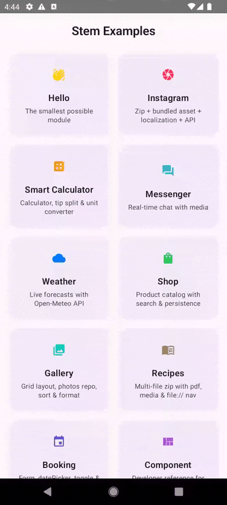

# StemJSON Examples

**Native Android UI/UX, generated by AI.** A set of runnable Android demos that show **StemJSON** in practice — the new JSON-based language AI writes, rendered as native Jetpack Compose by **StemRuntimeSDK**.

<p align="center">
  
</p>

## The idea

Every module in this repo was produced through AI-assisted authoring — human-designed prompts, human selection among candidate outputs, and human editorial curation of the final JSON. [StemJSON](https://github.com/vkrychun/StemJSON/blob/main/spec/v1.0.md) is a declarative JSON DSL designed to be *written by an LLM* and rendered as native Jetpack Compose by [StemRuntimeSDK](https://github.com/vkrychun/stem-runtime-kotlin). No web views, no React Native, no JavaScript bridge.

Point an AI at the [LLM spec](https://github.com/vkrychun/StemJSON/blob/main/spec/v1.0-ai.md) (or the [full spec](https://github.com/vkrychun/StemJSON/blob/main/spec/v1.0.md) for human context). Ask for the UI/UX you want. Drop the output into this workspace. Run it.

## Demos at a glance

| Project | What it is |
|---|---|
| [**StemQuickStart**](StemQuickStart/) | A single `ComponentActivity` that validates one JSON module and embeds the render. Copy this to start. |
| [**StemCompose**](StemCompose/) | Full showcase — every module type rendered modally. |
| [**StemHome**](StemHome/) ⭐ | Native Compose + StemJSON **mixed in the same app** with bidirectional state. |

### ⭐ Start with StemHome

The demo that answers: **can AI-generated UI coexist with hand-written Compose in the same app?** Yes — and this shows how.

Native Compose tabs alongside an LLM-generated StemJSON module, sharing state bidirectionally. Toggle a native device card → the JSON module receives it via `onCustom` and updates declaratively. Change JSON state → the native view reads it back through `runtime.subscribe` and re-renders. `runtime.trigger()` from Kotlin, `runtime.subscribe()` back — no bridge, no serialization per call, no polling.

The point: **you don't have to choose.** Let the AI generate the feature surface; keep the critical paths in the Kotlin code you wrote. Both live in the same screen, backed by the same state.

## Run it

```bash
git clone https://github.com/vkrychun/stem-examples-kotlin.git
cd stem-examples-kotlin
./gradlew :StemQuickStart:installDebug
```

Or open the project in Android Studio and run any of the three `Stem*` modules. **Android 7.0 (API 24)+**.

> Note: on physical devices, the freeware tier of StemRuntimeSDK displays a small "Powered by StemJSON" notice on rendered surfaces. This is removable under the paid SDK licence; see the [StemRuntimeSDK EULA](https://github.com/vkrychun/stem-runtime-kotlin/blob/main/LICENSE).

## Learn more

- [**StemJSON spec**](https://github.com/vkrychun/StemJSON/blob/main/spec/v1.0.md) — human-readable language specification.
- [**StemJSON — LLM reference**](https://github.com/vkrychun/StemJSON/blob/main/spec/v1.0-ai.md) — condensed reference optimised for LLM prompts.
- [**StemRuntimeSDK**](https://github.com/vkrychun/stem-runtime-kotlin) — the Kotlin / Compose runtime that renders it.

## License

The example code in this repository — Kotlin sources and JSON modules — is released under the [MIT License](LICENSE). Copy, adapt, ship.

The two projects this repo links against are governed by their own licenses:

- [**StemJSON specification**](https://github.com/vkrychun/StemJSON) — OWFa 1.0 with an additional attribution requirement.
- [**StemRuntimeSDK**](https://github.com/vkrychun/stem-runtime-kotlin) — its own End-User License Agreement.

If you redistribute or adapt the JSON modules in a product that implements StemJSON, the spec's attribution requirement still applies (see the [StemJSON LICENSE](https://github.com/vkrychun/StemJSON/blob/main/LICENSE)).

---

*StemJSON specification created by Vasyl Krychun — https://stemjson.com*

"StemJSON", "StemRuntimeSDK", "StemRuntime", and the StemJSON logo are trademarks of Vasyl Krychun. See the [StemJSON trademark policy](https://github.com/vkrychun/StemJSON/blob/main/TRADEMARK_POLICY.md) for permitted uses.
